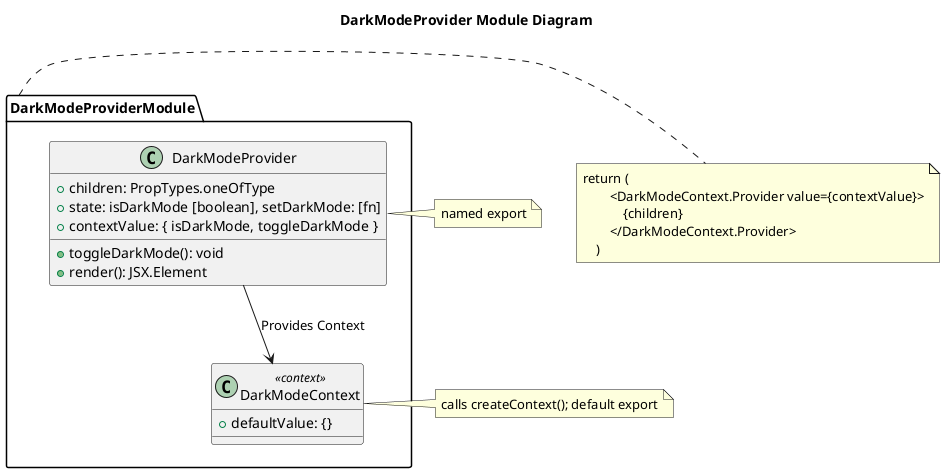

# React Provider Example

```plantuml
@startuml
title DarkModeProvider Module Diagram

package DarkModeProviderModule {
    class DarkModeProvider {
        + children: PropTypes.oneOfType
        + state: isDarkMode [boolean], setDarkMode: [fn]
        + toggleDarkMode(): void
        + contextValue: { isDarkMode, toggleDarkMode }
        + render(): JSX.Element
    }

    class DarkModeContext <<context>> {
        + defaultValue: {}
    }
    
    ' Relationship between elements in the file
    DarkModeProvider --> DarkModeContext : "Provides Context"
}

note right of DarkModeContext
  calls createContext(); default export
end note

note right of DarkModeProvider
  named export
end note

note right of DarkModeProviderModule
return (
        <DarkModeContext.Provider value={contextValue}>
            {children}
        </DarkModeContext.Provider>
    )
end note
@enduml
```